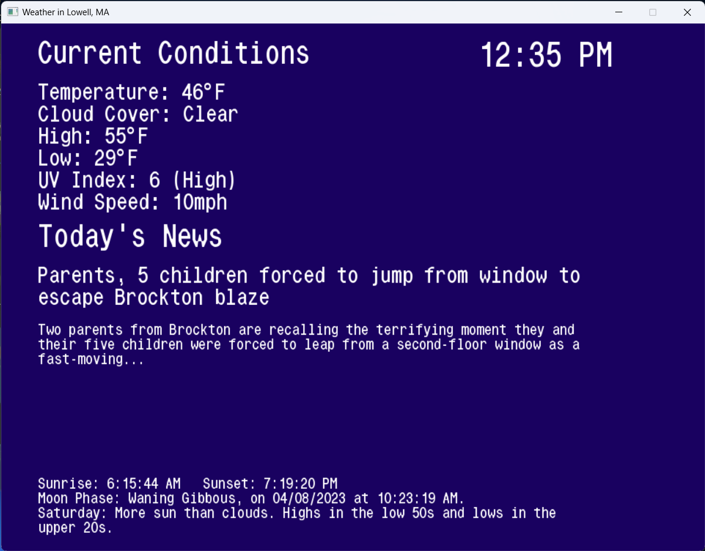

Canarium v3.0
=============

A weather application made using the Go programming language, loosely inspire/based off of probnot's wpg-weatherchan app, and the WeatherSTAR 3000 systems.

### Features

1.  Background color customization.
2.  RSS feeds, displayed as news.
3.  Current and accurate weather data, straight from Weather.com's API. (Updates every minute, due to the clock being part of the main goroutine)
4.  Music playback! (MP3, OGG, and FLAC are supported)
5.  5 day forecast, and more!
